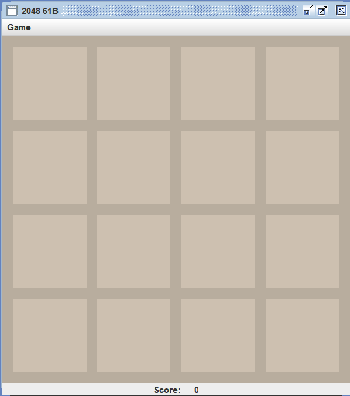

# 实验二：2048

> 本实验出处：[Berkeley 大学的公开课程: cs-61B](https://sp24.datastructur.es/projects/proj0/)

## 2048 玩法

2048 是由网络开发人员 Gabriel Cirulli 创建的 4x4 瓷砖游戏。游戏的目标是组合数字以创建更大的数字牌，以求达到数字 2048。

1. 滑动格子会在随机位置，出现随机的数字 2 和数字 4;
2. 图块有四种移动方式：上下左右滑动。相同数字合并为二者之和；
3. 分数： 游戏过程中的数字相加总和
4. 游戏结束：
   - 游戏胜利：合并数字出现 2048 即为成功；
   - 游戏失败：游戏界面被数字填满不能再滑动；


## 实验说明

重要的事说三遍：
**jdk version >=17**
**jdk version >=17**
**jdk version >=17**

你最好自行带电脑设备，或者带 u 盘来机房。因为这个实验需要多次上机方可完成，你需要保存你的代码。

### 导入项目

#### VS Code

`文件->打开文件夹`打开 2048 目录即可。

#### IDEA

`文件->打开`，选择打开 2048 文件，选择 SDK 版本>=17。
在 `Libraries tab` 中，将 `lib` 目录添加进来。

### 目录结构与运行程序

```bash
➜ eza --tree --level 2 --icons=never
./
├── asserts/
├── lib/
├── README.md*
├── src/
│  ├──  game2048logic/
│  └──  game2048rendering/
└── tests/
```

`lib` 目录下存放了项目所需的 jar 包。

`src\game2048rendering\Main.java` 是程序的主函数入口，打开此文件点击执行应看到如下的界面。


该项目已完成 ui 相关的代码 `src\game2048rendering`。

你只需要实现 `src\game2048logic\Model.java` 中的空余的部分即可，后简称 `Model.java` 文件。

`tests\game2048logic`目录下是每个任务的测试模块，你应该从中学习如何为你的程序编写测试用例代码。后续关于测试文件的说明，默认指该目录下的文件。
测试操作：打开文件，点击对应的函数执行测试；或者在工作区内右键待测试的文件，点击运行测试。

- vscode 操作如下
  

  

- idea 操作如下
  
  

### **实验要求**

对任意上机任务完成时间不做要求，你需要在最后一次理论课（期末考试）那一周的周末，完成**最后提交**。
若你提前完成实验并提交了结果，你需要给老师看你所有的测试用例都已通过。则后续的实验课，**呆半个小时**后可以自行离开。

#### 问题思考

理论上，我们要实现上下左右 4 个方向的移动，每次移动发生了合并要更新分数，并且存在多种的合并方式：

- 两个相同的数字合并为一个图块
- 单次性：假设有一行为 `[4,4,4,4]`，发生向右滑动，则变为 `[0,0,8,8]`，而不是 `[0,0,0,16]`
- 边缘优先： 假设有一行为 `[0,8,8,8]`，发生向右滑动，则变为 `[0,0,8,16]`，而不是 `[0,0,16,8]`

同时思考这些问题会使得逻辑非常的复杂，因此需要将问题步骤化、模块化来进行理顺开发思路：

- **分数更新**：分数处理和滑块移动的逻辑可以分开处理，分数更新实现放在最后完成。
- **合并规则**： 合并发生在移动后，因此可以实现移动之后，再实现合并。
- **一个方向**：理论上，只要实现了一个方向移动，其余三个方向移动，都只是坐标的变化。
- **一列移动**：现在只考虑向上移动，当向上移动的时候。4 列本质上都是单独处理合并，因此可以独立出一个函数来单独处理某列的移动。
- **逐块移动**：我们只需要每次按边缘方向倒着逐块移动，这样就可以方便的处理不同的合并情况。
- **游戏结束**：游戏结束有两个情况：
  1.  **移动合并后无空位剩余**
  2.  **最大值 2048 出现**

#### 第一次上机任务

1. 完成项目的导入，初始程序运行，学习使用测试。
2. 在`Model.java`中，实现`emptySpaceExists()`方法：如果棋盘上的任何图块为空，则该方法应返回 `true`。\
   **测试**：你需要使用 `TestEmptySpace.java` 进行测试调试，确保测试输出全部通过。\
   **棋盘格子说明**：
   

   - `src\game2048rendering\Board.java` 中提供了 Board.tile() 方法，请仔细阅读其使用。
   - `src\game2048rendering\Tile.java` 中定义了 Tile 类，如果 Tile 类为 null，则表示棋盘上存在空的图块。

3. 在`Model.java`中，实现`maxTileExists()` 方法。 如果板上的任何图块具有获胜值（默认 2048），则此方法应返回 true。
   **测试**：你需要使用 `TestMaxTileExists.java` 进行测试调试，确保测试输出全部通过。\
   **注意**：您应该使用常量 `MAX_PIECE`（已定义），而不是在代码中硬编码数字 2048。 例如，您应该编写 if (x == MAX_PIECE) 而不是 if (x == 2048)。
   > 幻数（magic number）： 保留像 2048 这样的硬编码数字是一种不好的编程习惯，有时被称为“幻数”。 这种神奇数字的危险在于，如果您在代码的一部分而不是另一部分更改它们，则可能会得到意想不到的结果。 通过使用 MAX_PIECE ，您可以确保它们全部一起更改。

#### 第二次上机任务

1. 在 `Model.java` 中，填写 `atLeastOneMoveExists()` 方法。 如果有任何有效的移动，此方法应返回 true。\
   **测试**：你需要使用 `TestAtLeastOneMoveExists.java` 和 `TestModel.java` 进行测试调试，确保测试输出全部通过。
   **有效移动**：如果存在玩家可以按下的按钮（上、下、左、右），这将导致至少一个图块移动，则存在有效的移动。你应该注意到 `atLeastOneMoveExists()` 方法依赖 `emptySpaceExists()` 方法，只有存在空白的方块才能进行有效的移动。 有效的移动有两种方式存在：

   - 棋盘上至少有一个空白区域。
   - 有两个相邻（它们之间可以有空白）的图块具有相同的值。

2. 在`Model.java`中，实现`moveTileUpAsFarAsPossible(int x, int y)` 方法。此方法应将位置 (x, y) 处的图块在其列中尽可能远地移动（暂不考虑图块的合并）。
   **测试**：你需要使用 `tests\game2048logic\TestMoveTileUp.java` 进行测试调试。
   **尽可能移动**：请记住，图块可以向上移动穿过空的方块，直到图块到达顶行，或者图块到达空的方块且其正上方有另一个图块。在 Board 类中，提供了 `move(int x,int y,Tile tile)`，该方法将指定的 tile 移动至指定的 `(x, y)` 坐标上。

#### 第三次上机任务

1. 修改你上次上机实现的`moveTileUpAsFarAsPossible(int x, int y)` 方法，使其考虑图块的合并。
   **测试**：你需要通过 `TestMoveTileUp.java` 中 `testTwoTilesMergeNoScore()` 的测试。
   **合并**：图块可以向上移动穿过空的方块。 当图块看到一个非空方块时，如果该方块包含另一个具有相同值的图块，并且该图块尚未从此方向合并，则这两个图块应该合并。你可以使用 `Tile` 类中的 `wasMerged` 方法来跟踪滑块是否发生合并，并且 `move`方法会处理值得更新。

2. 在 `Model.java` 中，填写 `tiltColumn(int x)`方法。此方法应在坐标 x 处向上倾斜给定列，将该列中的所有图块移动到正确的位置，并合并该列中需要合并的所有图块。很明显，该方法会调用你之前实现的 `moveTileUpAsFarAsPossible`
   **测试**: 通过`TestTileColumn.java`中的 `testNoMergeColumn` 与 `testMergingColumn`。

#### 第四次上机任务

1. 现在**只考虑向上滑动**。在 `Model.java` 中，初步实现 `tilt(Side side)` 方法。此方法应该使所有的图块向上滑动，将所有列中的所有图块移动到正确的位置，并合并任何需要合并的图块。显然，你需要调用上一次实现的`tiltColumn(int x)`方法。
   **测试**：通过 `TestUpOnly.java` 中的 `testUpNoMerge` 方法。

2. 完善 `tilt(Side side)` 方法,对四个方向都实现滑动。
   **Side**: `src\game2048rendering\Side.java` 中 Side 类是一个枚举类：`NORTH`, `SOUTH`, `EAST`, and `WEST`。
   **Board**: `src\game2048rendering\Board.java` 中 Board 类提供了 `setViewingPerspective(Side s)`，该函数将更改图块和移动类的行为，以便它们的行为就像给定的一侧是都是**上**一样。假设原始的棋盘如下，我们目的是向左滑动，合并 两个 16：
   ```plaintext
   |    |    |    |    |
   |  16|    |  16|    |
   |    |    |    |    |
   |    |    |    |   2|
   ```
   使用 `board.setViewingPerspective(Side.WEST)` ，那么棋盘则发生 90 的顺时针旋转（以西为北）
   ```plaintext
   |    |    |  16|    |
   |    |    |    |    |
   |    |    |  16|    |
   |   2|    |    |    |
   ```
   这个时候，再调用实现的 `tilt(Side.NORTH)`，则发生更新：
   ```plaintext
   |   2|    |  32|    |
   |    |    |    |    |
   |    |    |    |    |
   |    |    |    |    |
   ```
   别忘了，我们的棋盘是发生了旋转朝西，因此棋盘需要转回只北方向。
   ```plaintext
   |    |    |    |    |
   |  32|    |    |    |
   |    |    |    |    |
   |   2|    |    |    |
   ```

#### 第五次上机任务

1. 在 `Model.java` 中，变量 `Score` 用来存储玩家的分数，当你游戏过程中，发生了合并的变动，你应该更新这个变量。你需要在之前实现合并的方法中，完成分数的同步。
   **测试**：你已完成整个游戏的全部逻辑，tests 目录下所有的文件
   **得份规则**：假设游戏开始时初始棋盘如下：

   ```plaintext
   |   2|    |   2|    |
   |   4|   4|   2|   2|
   |    |   4|    |    |
   |   2|   4|   4|   8|
   ```

   按上键后，棋盘更新如下：

   ```plaintext
   |   2|   8|   4|   2|
   |   4|   4|   4|   8|
   |   2|    |    |    |
   |    |    |    |    |
   ```

   总共合并了出了一个 8 和一个 4，因此得 12 分。

2. 赢得一次游戏，并截图！
   重要的事说三遍：
   **将程序左上角的窗口名，改为你的学号**
   **将程序左上角的窗口名，改为你的学号**
   **将程序左上角的窗口名，改为你的学号**

#### 最后提交

你最后应该完整的实现 2048 游戏逻辑，并将程序的左上角窗口名改为你的学号。截图并上传你最终赢得 2048 游戏胜利的游戏画面。

# 拓展阅读

## java 测试框架 [JUnit](https://junit.org/junit5/)

> 在实际的工程中，你不应该在每个模块下写 main 函数来进行调试，而是应该通过编写测试文件来调试。

在 Java 中编写测试是一个重要的环节，它有助于确保代码的质量、稳定性和可维护性。代码测试是软件开发中的重要环节，主要包括以下几个部分：

- ‌ **单元测试** ‌：针对程序中的最小可测试单元（如函数、类等）进行检查和验证，确保其基本功能正确性。通常使用测试框架进行自动化测试。‌
- ‌ **集成测试** ‌：将多个独立的模块组合在一起，测试它们之间的接口和交互是否正常，主要检查模块之间的协调性和兼容性。‌
- **系统测试** ‌：对整个系统进行全面测试，检查其是否符合需求和规格说明，包括功能、性能、安全性等方面的测试。‌
- **验收测试**‌：由客户或用户执行的测试，确认软件已满足所有规格和需求，准备好发布和交付。‌

> 为实现的功能，编写对应的单元测试是一个良好的习惯。在 ci-cd 工作流中，会集成自动单元测试，当单元测试未通过时，git 提交的代码会被驳回。

黑盒、白盒、灰盒测试是软件测试中的三种主要方法，每种方法有其特定的含义和用途 ‌。

- ‌ **黑盒测试** ‌：也称为功能测试，主要用于检测软件的功能是否按照需求规格说明书的规定正常使用。测试人员不考虑程序内部结构和内部特性，只关注输入数据与输出数据的对应关系，以及程序是否能适当地接收输入数据并产生正确的输出信息 ‌ 。
- ‌ **白盒测试** ‌：也称为结构测试，测试人员根据程序的控制结构设计测试用例，利用程序内部的逻辑结构及有关信息，检验程序中的每条通路是否都能按预定要求进行正确工作。它主要用于分析程序内部的结构和逻辑 ‌。
- ‌ **灰盒测试** ‌：介于黑盒测试与白盒测试之间，不仅关注输出、输入的正确性，同时也关注程序内部的情况，但不像白盒测试那样详细、完整。它主要用于集成测试阶段，评价应用软件的设计 ‌

Java 社区提供了多种测试框架和工具，其中最流行的是 JUnit 和 TestNG。在 2048 项目中，采用的是 JUnit。

测试类通常放在与被测试类同包下，与被测试的功能/类同名，并有 Test 相关的字样。通过 `@Test` 装饰方法，表明该方法为测试方法。

> 为了区分业务代码与测试代码，更为常见的项目目录组织方式是 业务放在 `src` 目录下，测试代码放在 `tests` 目录下。但是要保证，测试类与被测试类在同一包下。
> 在 2048 项目中， `tests` 目录下就是 `game2048logic` 与 `src` 下的 `game2048logic` 包名一致。

假设代码如下

```java
// Calculator.java
public class Calculator {
    public int add(int a, int b) {
        return a + b;
    }
}
```

为其编写测试用例：

```java
// TestCalculator.java
import org.junit.jupiter.api.Test;
import static org.junit.jupiter.api.Assertions.assertEquals;

public class TestCalculator {

    @Test
    public void testAdd() {
        Calculator calculator = new Calculator();
        assertEquals(5, calculator.add(2, 3), "2 + 3 should equal 5");
    }
}
```

## UC Berkeley 与 BSD

unix 系统有两大分支。其中一个分支便是 BSD(Berkeley Software Distribution)，它是 Berkely 大学计算机研究小组维护的。苹果 mac 操作系统的内核 darwin，是在 BSD 的发行版之一 FreeBSD 的基础上改造的。

unix 另一个大分支便是 linux/gnu ，也就是常说的 linux 操作系统。

## 2048 游戏策略

蛇形链条：链条是一种将较小的数字保留在棋盘的一侧而将较大的数字保留在另一侧的方法，这条链上从大到小每个数都是下一个数的两倍。

